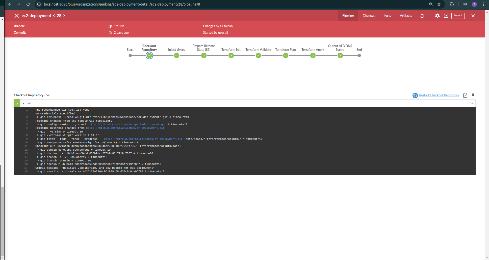
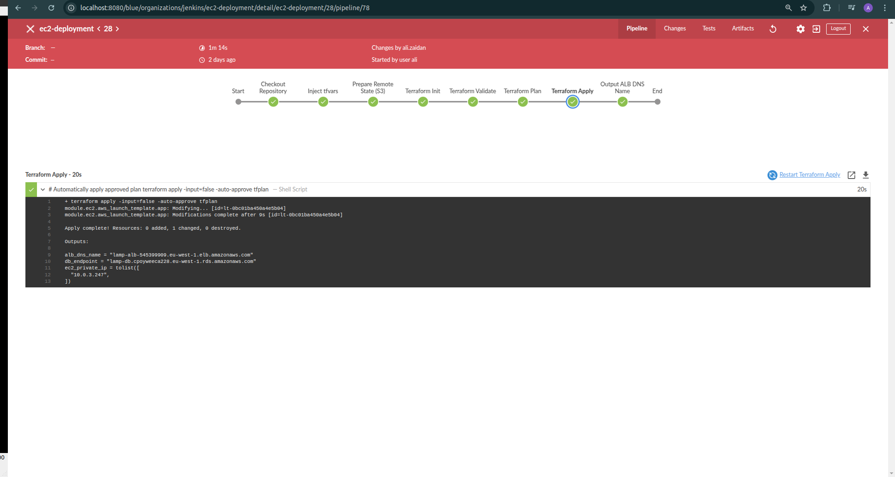
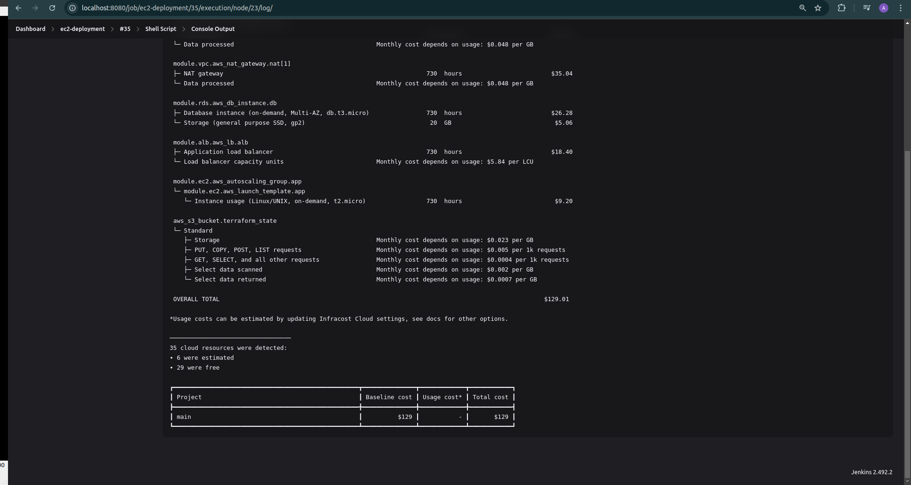
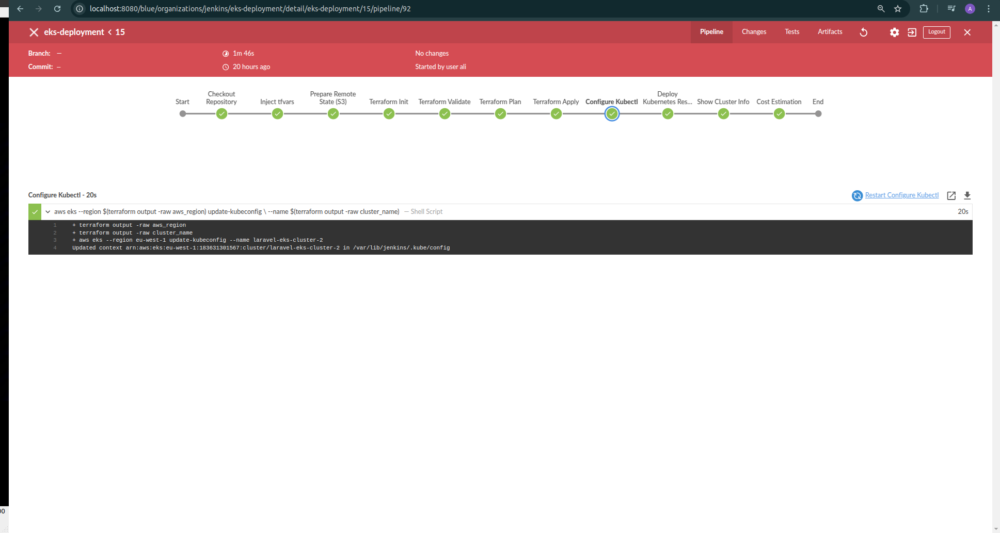
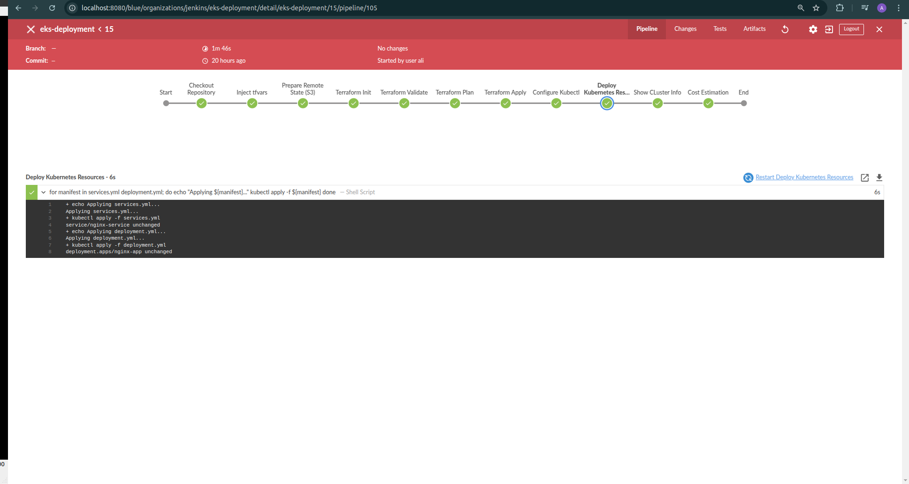
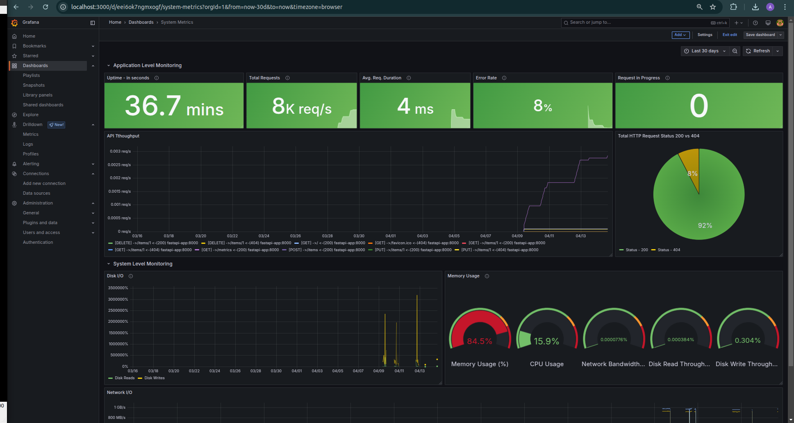
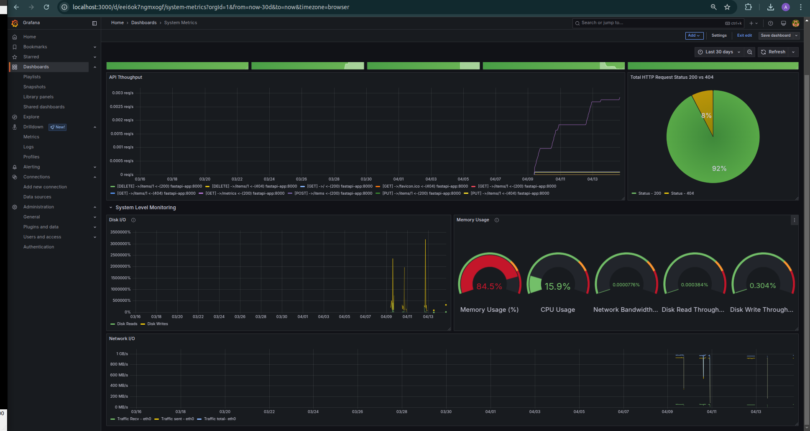

---

# Terraform Infrastructure Deployments and Monitoring Guide

*Building robust cloud architecture applications on AWS *

  
*This diagram illustrates the complete pipeline flow for the EC2 and EKS deployments, starting from code checkout, through Terraform stages, and ending with outputting the ALB DNS name.*

## Table of Contents

- [Introduction](#introduction)
- [Prerequisites](#prerequisites)
- [Terraform Infrastructure Deployments](#terraform-infrastructure-deployments)
  - [Laravel EC2 Deployment](#laravel-ec2-deployment)
    - [Directory Structure](#ec2-directory-structure)
    - [Deployment Steps](#ec2-deployment-steps)
    - [Jenkins Pipeline](#ec2-jenkins-pipeline)
    - [Cost Management](#ec2-cost-management)
  - [Laravel EKS Deployment](#laravel-eks-deployment)
    - [Directory Structure](#eks-directory-structure)
    - [Deployment Steps](#eks-deployment-steps)
    - [Jenkins Pipeline](#eks-jenkins-pipeline)
    - [Cost Management](#eks-cost-management)
  - [Architecture Comparison](#architecture-comparison)
  - [Security Best Practices](#security-best-practices)
  - [Scaling Considerations](#scaling-considerations)
- [Monitoring with Prometheus and Grafana](#monitoring-with-prometheus-and-grafana)
  - [Overview](#overview)
  - [Directory Structure](#monitoring-directory-structure)
  - [Setup Instructions](#setup-instructions)
  - [Accessing the Tools](#accessing-the-tools)
  - [Using the Grafana Dashboard](#using-the-grafana-dashboard)
    - [Application Level Monitoring](#application-level-monitoring)
    - [System Level Monitoring](#system-level-monitoring)
  - [Customizing the Setup](#customizing-the-setup)
- [Troubleshooting](#troubleshooting)
- [Contributing](#contributing)
- [License](#license)

---

## Introduction

This guide provides detailed instructions for deploying Laravel and Nginx  applications on AWS using two distinct architectures managed with Terraform as Infrastructure as Code (IaC):

- A traditional EC2-based setup.
- A modern Kubernetes solution using EKS.

Additionally, it includes a monitoring setup using Prometheus and Grafana to collect and visualize system-level and application-level metrics for your deployed applications. Whether you're building a personal project, a startup application, or an enterprise system, these deployment options and monitoring tools will help you establish a production-ready environment with scalability, security, operational efficiency, and observability.

---

## Prerequisites

To follow this guide, ensure you have the following tools installed and configured:

- **AWS CLI**: Required for both EC2 and EKS deployments. Configure with appropriate IAM credentials.
  ```bash
  aws --version  # Should be 2.0+ for full EKS support
  ```

- **Terraform**: Version 1.5.0 or newer, required for infrastructure deployments.
  ```bash
  terraform --version
  ```

- **kubectl**: Required for EKS deployment.
  ```bash
  kubectl version --client
  ```

- **Jenkins**: Required for CI/CD pipelines, with the following plugins:
  - Git
  - Pipeline
  - AWS Credentials
  - Credentials Binding

- **Infracost**: Optional, for cost estimation.
  ```bash
  infracost --version
  ```

- **Docker**: Required for the monitoring setup.
- **Docker Compose**: Required for the monitoring setup.
- **Git**: Optional, for cloning repositories.

Ensure your system has sufficient permissions to run Docker containers and access AWS resources.

---

## Terraform Infrastructure Deployments

This section covers deploying Laravel applications on AWS using Terraform, with two options: EC2 and EKS. Each includes directory structures, deployment steps, Jenkins pipeline configurations, and cost management strategies.

### Laravel EC2 Deployment

The EC2 deployment uses traditional virtual machines with an Application Load Balancer (ALB), an Auto Scaling Group running Docker-containerized Laravel applications, and an RDS database. Ideal for teams familiar with server management who want container benefits.

#### EC2 Directory Structure

```
laravel-ec2-deployment/
├── Jenkinsfile              # CI/CD pipeline definition
├── main.tf                  # Main Terraform configuration
├── modules/                 # Reusable Terraform modules
│   ├── alb/                 # Application Load Balancer configuration
│   ├── ec2/                 # EC2 instances with Auto Scaling Group
│   ├── iam/                 # IAM roles and policies
│   ├── rds/                 # RDS MySQL database
│   ├── security_group/      # Security groups for all components
│   └── vpc/                 # VPC, subnets, NAT Gateways, and routing
├── outputs.tf               # Terraform outputs (ALB DNS, EC2 IPs, etc.)
├── provider.tf              # AWS provider and S3 backend configuration
├── terraform.tfvars         # Variable values (stored securely in Jenkins)
└── variables.tf             # Variable declarations
```

**Key Scripts**  
- `bash_scripts/state_file.sh`: Creates an S3 bucket for Terraform state.  
- `bash_scripts/cost_estimate.sh`: Estimates costs using Infracost.  
- `bash_scripts/nuke.sh`: Emergency cleanup script.

#### EC2 Deployment Steps

1. **Prepare Terraform State Storage**
   ```bash
   cd bash_scripts/
   ./state_file.sh
   ```
   Creates an encrypted S3 bucket with versioning and state locking.

2. **Initialize Terraform**
   ```bash
   cd laravel-ec2-deployment/
   terraform init
   ```

3. **Review Planned Infrastructure**
   ```bash
   terraform plan
   ```

4. **Deploy the Infrastructure**
   ```bash
   terraform apply
   ```
   Takes ~10-15 minutes to create VPC, RDS, EC2, etc.

5. **Access Your Application**
   ```bash
   echo "Your application is available at: $(terraform output -raw alb_dns_name)"
   ```

#### EC2 Jenkins Pipeline

The `Jenkinsfile` orchestrates deployment with these stages:  
- Code checkout  
- Secure variable injection  
- S3 backend prep  
- Terraform init/validation  
- Infrastructure deployment  
- Output extraction  

  
*Repository checkout stage showing successful code retrieval*  

  
*Terraform apply stage showing resource provisioning*

#### EC2 Cost Management

Use Infracost for cost monitoring:  
```bash
cd laravel-ec2-deployment/
terraform plan -out=tfplan
infracost breakdown --path=tfplan --format=json --out-file=infracost.json
../bash_scripts/cost_estimate.sh
```

  
*Monthly cost breakdown for EC2-based infrastructure*

---

### Laravel EKS Deployment

The EKS deployment uses Kubernetes for enhanced scalability and resource utilization, ideal for microservices or advanced deployment strategies.

#### EKS Directory Structure

```
k8s_deployment/
├── Jenkinsfile              # CI/CD pipeline definition
├── main.tf                  # Main Terraform configuration for EKS
├── modules/                 # Reusable Terraform modules
│   ├── eks/                 # EKS cluster and node groups
│   ├── iam/                 # IAM roles for EKS
│   └── security_group/      # Security groups for EKS
├── k8s/                     # Kubernetes manifests
│   ├── deployment.yml       # Pod deployment configuration
│   └── services.yml         # LoadBalancer service configuration
├── outputs.tf               # Terraform outputs (cluster endpoint, etc.)
├── provider.tf              # AWS provider and S3 backend configuration
├── terraform.tfvars         # Variable values (stored securely)
└── variables.tf             # Variable declarations
```

**Key Scripts**  
- `bash_scripts/deploy.sh`: Alternative deployment script.  
- `bash_scripts/state_file.sh`: S3 bucket creation.  
- `bash_scripts/cost_estimate.sh`: Cost estimation.

#### EKS Deployment Steps

1. **Prepare Terraform State Storage**
   ```bash
   cd bash_scripts/
   ./state_file.sh
   ```

2. **Initialize and Apply Terraform**
   ```bash
   cd k8s_deployment/
   terraform init
   terraform plan
   terraform apply
   ```

3. **Configure kubectl**
   ```bash
   aws eks --region $(terraform output -raw aws_region) update-kubeconfig \
     --name $(terraform output -raw cluster_name)
   ```

4. **Deploy Kubernetes Resources**
   ```bash
   cd k8s/
   kubectl apply -f services.yml
   kubectl apply -f deployment.yml
   ```

5. **Access Your Application**
   ```bash
   echo "Your application is available at: $(kubectl get svc nginx-service -o jsonpath='{.status.loadBalancer.ingress[0].hostname}')"
   ```

#### EKS Jenkins Pipeline

The pipeline includes Kubernetes-specific stages:  
- Infrastructure provisioning  
- Kubectl configuration  
- Kubernetes manifest deployment  
- Cluster info output  

  
*Kubectl configuration stage showing successful cluster connection*  

  
*Kubernetes resources deployment showing successful pod creation*

#### EKS Cost Management

```bash
cd k8s_deployment/
terraform plan -out=tfplan
infracost breakdown --path=tfplan --format=json --out-file=infracost.json
../bash_scripts/cost_estimate.sh
```

---

### Architecture Comparison

| Feature                | EC2 Deployment         | EKS Deployment          |
|-----------------------|------------------------|-------------------------|
| **Scaling**           | Auto Scaling Groups    | Fixed ReplicaSet (e.g., 2 replicas) |
| **Resource Efficiency** | Good                  | Excellent              |
| **Deployment Complexity** | Moderate            | Higher                 |
| **Learning Curve**    | Lower                  | Steeper                |
| **Update Strategy**   | Rolling updates        | Multiple strategies    |
| **Typical Cost**      | Moderate               | Higher base, better optimization |
| **Best For**          | Traditional apps       | Microservices, complex deployments |

---

### Security Best Practices

- **Least Privilege IAM**: Roles follow minimal permissions.  
- **Network Isolation**: Private subnets with controlled access.  
- **Security Groups**: Granular traffic control.  
- **Secrets Management**: Securely managed sensitive data.  
- **Encryption**: Data encrypted at rest and in transit.

---

### Scaling Considerations

**EC2 Deployment**  
- Auto Scaling Groups use CPU/memory thresholds.  
- ALB distributes traffic.  
- Scaling creates new instances from AMIs/launch templates.  

**EKS Deployment**  
- **Static Replica Set**: Fixed pods (e.g., `replicas: 2`).  
- **Cluster Autoscaler**: Adjusts worker nodes based on demand.  
- **Manual Scaling**: Update `replicas` in manifest.

---

## Monitoring with Prometheus and Grafana

This section sets up a monitoring stack using Prometheus and Grafana to visualize system-level and application-level metrics. It uses Docker Compose and includes a pre-configured dashboard.

### Overview

Components:  
- **Prometheus**: Time-series database for metric scraping.  
- **Grafana**: Visualization tool with dashboards.  
- **Node Exporter**: System metrics (CPU, memory, etc.).  
- **FastAPI App**: Sample app for application metrics.  

The dashboard splits into **Application Level Monitoring** and **System Level Monitoring**.

### Directory Structure

```
prometheus-grafana/
├── docker-compose.yml       # Defines services
├── prometheus/              # Prometheus config
│   └── prometheus.yml       # Scrape targets
└── grafana-dashboard.json   # Configured dashboard
```

### Setup Instructions

1. **Prepare Files**  
   Ensure `docker-compose.yml`, `prometheus/prometheus.yml`, and `grafana-dashboard.json` are in your directory.

2. **Start the Stack**
   ```bash
   docker-compose up -d
   ```

3. **Verify Services**
   ```bash
   docker-compose ps
   ```
   Confirm all services (`prometheus`, `grafana`, `node-exporter`, `fastapi-app`) are `Up`.

### Accessing the Tools

- **Prometheus UI**: [http://localhost:9090](http://localhost:9090)  
- **Grafana UI**: [http://localhost:3000](http://localhost:3000) (Login: `Username: admin`/`Password: admin`)  
- **Node Exporter**: [http://localhost:9100/metrics](http://localhost:9100/metrics)  
- **FastAPI App**: [http://localhost:8000](http://localhost:8000)  
- **FastAPI Metrics**: [http://localhost:8000/metrics](http://localhost:8000/metrics)

### Using the Grafana Dashboard

1. **Access Grafana**  
   Go to [http://localhost:3000](http://localhost:3000), log in with `admin`/`admin`.

2. **Import Dashboard**  
   - Click **Dashboards** > **Import**.  
   - Upload `grafana-dashboard.json`.  
   - Save the dashboard.

#### Application Level Monitoring

Metrics:  
- **Uptime**: App runtime (seconds).  
- **Total Requests**: HTTP requests processed.  
- **Avg. Req. Duration**: Average response time (seconds).  
- **Error Rate**: Failed requests (4xx/5xx, %).  
- **Requests in Progress**: Active requests.  
- **API Throughput**: Request rate (req/s).  
- **Status Breakdown**: Pie chart of statuses.  

  
*Application Level Monitoring showing key app metrics.*

#### System Level Monitoring

Metrics:  
- **Disk I/O**: Read/write rates (bytes/s).  
- **Memory Usage**: CPU, memory, network, disk metrics (% and MB/s).  
- **Network I/O**: Transmit/receive rates (MB/s).  

  
*System Level Monitoring showing resource usage.*

### Customizing the Setup

- **Prometheus**: Edit `prometheus.yml` for new targets:  
  ```yaml
  - job_name: 'new-service'
    static_configs:
      - targets: ['new-service:port']
  ```

- **Grafana**: Update dashboard in UI, export to `grafana-dashboard.json`. Change password:  
  ```yaml
  environment:
    - GF_SECURITY_ADMIN_PASSWORD=newpassword
  ```

- **Additional Exporters**: Add services (e.g., `cadvisor`) to `docker-compose.yml` and `prometheus.yml`.  
- **Security**: Restrict access in production (e.g., firewall, proxy).

---

## Troubleshooting

**EC2 Issues**  
- ALB health check fails: Check security groups/instance health.  
- DB connection fails: Verify RDS rules.  
- Auto Scaling issues: Review launch templates/ASG config.  

**EKS Issues**  
- Pod scheduling fails: Check node resources/taints.  
- Service connectivity: Verify network policies/security groups.  
- Auth issues: Review AWS auth config map.  

**Monitoring Issues**  
- Prometheus not scraping: Check `prometheus.yml`/network.  
- Grafana no data: Verify data sources/scraping.  
- FastAPI metrics missing: Check endpoint/app config.

---

## Contributing

Contributions are welcome!  
1. Fork the repository.  
2. Create a branch for your changes.  
3. Test thoroughly.  
4. Submit a pull request with a clear description.  

Guidelines:  
- Clear commit messages.  
- Update docs.  
- Add tests.  
- Consistent style.

---

## License

This project is licensed under the MIT License - see the [LICENSE](LICENSE) file for details.

---

### Notes on Improvements

- **Structure**: The README now clearly separates Terraform deployments (EC2 and EKS) and the Prometheus/Grafana monitoring setup as distinct sections under a unified TOC.  
- **Grafana/Prometheus**: This section is streamlined with a clear TOC, consistent subsections, and proper image paths (standardized to `demo_images/prometheus-grafana/`).  
- **Consistency**: Image references, code blocks, and formatting are uniform. The FastAPI app is kept as a sample; adapt it to Laravel if needed.  
- **Clarity**: Each section is self-contained, with prerequisites consolidated upfront and specific requirements noted where applicable.